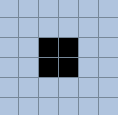
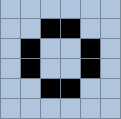
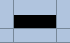
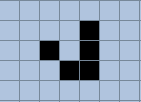

# Клеточные автоматы
Достаточно популярна стала тема клеточных автоматов. Как следует из википедии клеточный автомат это 
>Дискретная модель, изучаемая в математике, теории вычислимости, физике, теоретической биологии и микромеханике. Включает регулярную решётку ячеек, каждая из которых может находиться в одном из конечного множества состояний, таких как 1 и 0.

Говоря простым языком, клеточный автомат это - нейкое сеточное поле состоящая из квадратов (далее ячеек). Также поле является безграничным (что невозможно в реалиях языков программирования) или замкнутым. Ячейки могут быть либо "живыми", либо "мертвыми". Живая ячейка или нет будет определяться по правилам. 
Правил может быть очень много, однако мы рассмотрим самое популярное B3/S23 или же, правило "игры жизни" придуманное ___Джоном Конвеем___ в 1970 году. Названо оно не просто так, так как показывает примерную структуру окружающей нас жизни. У каждой ячейки есть 8 соседей и из этого будут следовать правила:
- Если у "мертвой" ячейки есть 3 "живых" соседа, значит она "оживает"
- Если у "живой" ячейки присутствует 2 или 3 "живых" соседа, то она выживает 
- В противном случае она "умирает".

Ячейки как-бы "умирают" от перенаселения или нехватки населения. Правила будут проверяться каждую итерацию (поколение) и будет получаться каждый раз новое поле с новыми расположениями "живых" и "мертвых" ячеек. Игра считается оконченной когда поле становиться пустым, либо остаются устойчивые фигуры, о которых мы поговрим позже.
____________________
Несмотря на простоту правил, данный клеточный автомат может выдвать очень сложное поведение. Также он является Тьюринг полным, тоесть на нем можно производить вычисление. Присутствуют и фигуры которые могу быть разного вида.
_____________________
## Фигуры в "игре жизни"

1. Устойчивые фигуры (являются неизменными при итерировании). 
    >
    >
2. Циклические фигуры (находятся на одном месте и меняются в прежний вид при определённом периоде).
    >
3. Двигающиеся фигуры (бесконечно могут перемещаться по полю)
    >
________________________________________
Это основные фигуры из которых при следующих итерациях буду генерироваться более сложные фигуры (ружья, долгожители и тд.).

## Программная реализация на языке Python
*Полный код клеточного автомата вы можете посмотреть в репозиторие.*

Помогать нам будет библиотека ***pygame*** для рисования графки. Алгоритм таков:

- Создадим класс приложение MainApp
- C помощью pygame нарисуем клеточное поле
- Создадим класс Grid, который будет является объектом поля и будет содержать методы итерации, очистки и т.д.
- В методе update класса MainApp создадим цикл с основными событиями приложения (отрисовка, итерация)

Так у нас получился файл main.py в котором находться основная логика клеточного автомата.
__________________
Информация была взята с сайта [Википедия](https://ru.wikipedia.org/wiki/Клеточный_автомат)
